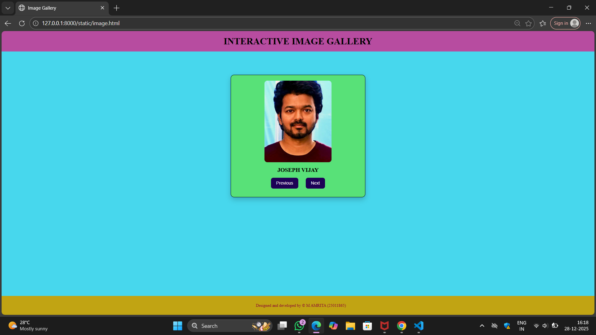
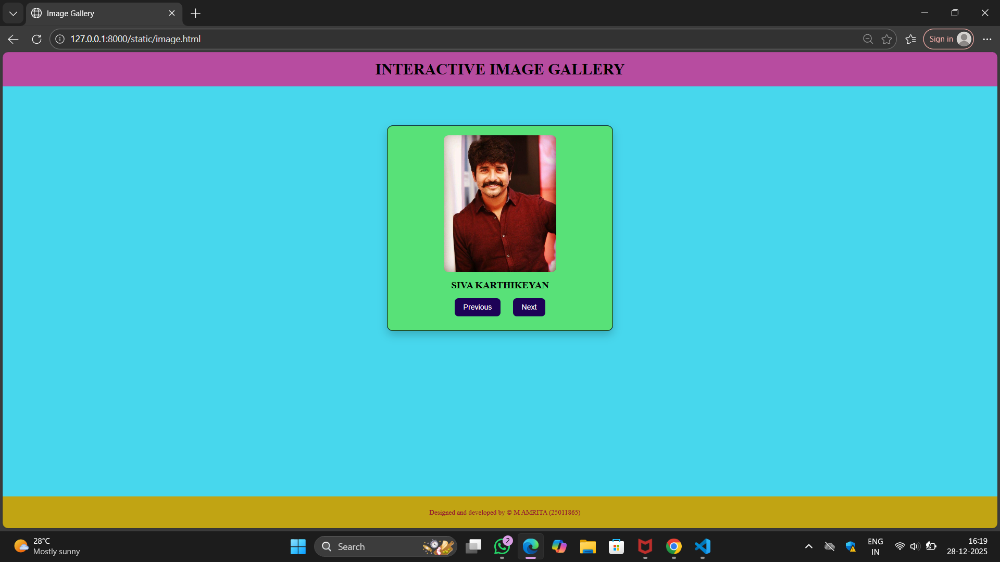
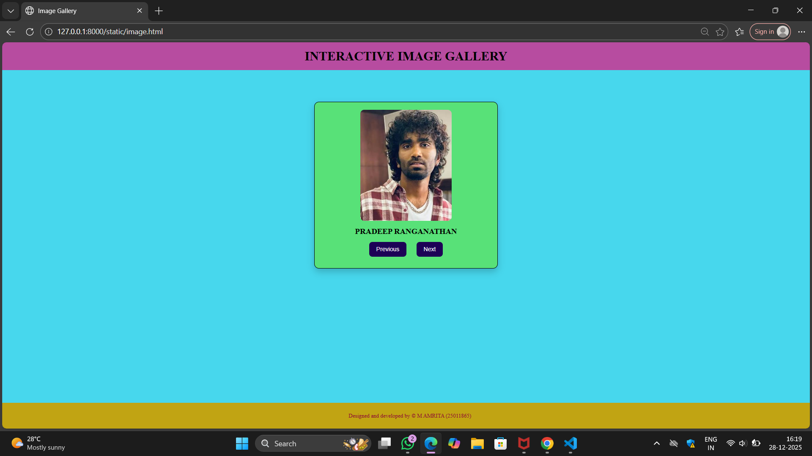
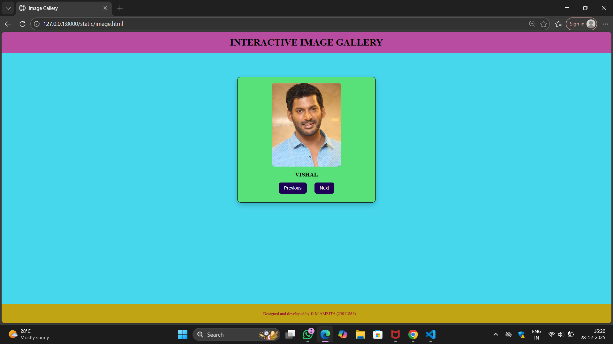
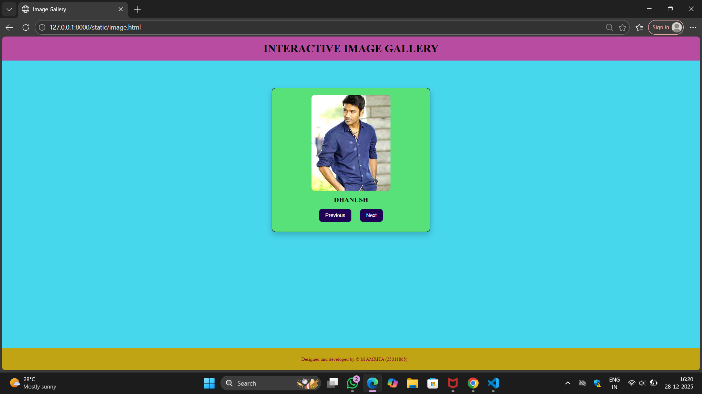
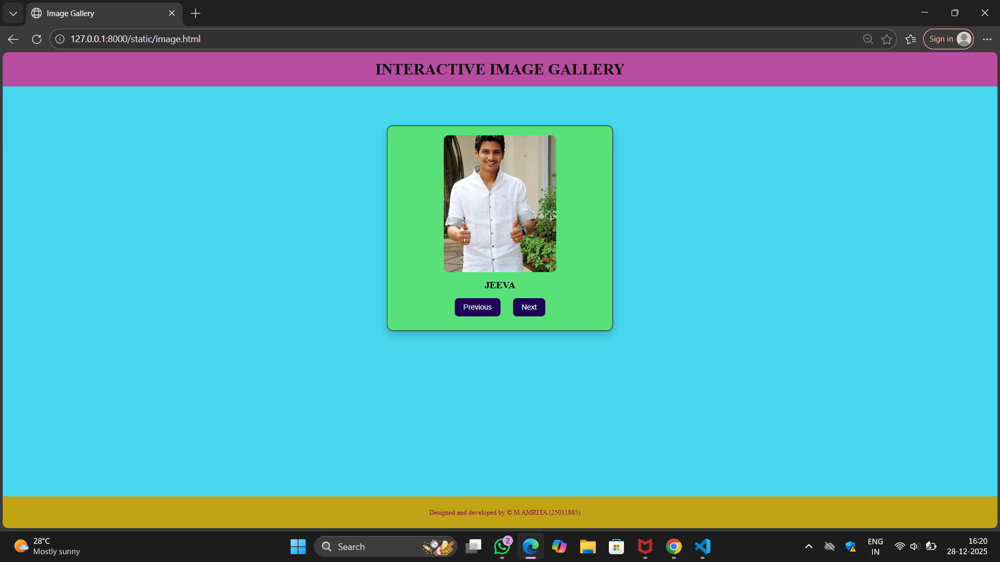

# Ex.07 Design of Interactive Image Gallery
## Date:28-12-2025

## AIM:
To design a web application for an inteactive image gallery for a minimum five images with next and previous buttons.

## DESIGN STEPS:

### Step 1:
Clone the github repository and create Django admin interface.

### Step 2:
Change settings.py file to allow request from all hosts.

### Step 3:
Use CSS for positioning and styling.

### Step 4:
Write JavaScript program for implementing interactivity.

### Step 5:
Validate the HTML and CSS code.

### Step 6:
Publish the website in the given URL.

## PROGRAM:

```
image.html

<html>
<head>
    <title>Image Gallery</title>
    <link rel="stylesheet" href="image.css">

    <script>
        const gallery = [
            { src: "v1.jpg", caption: "JOSEPH VIJAY" },
            { src: "sk.jpg", caption: "SIVA KARTHIKEYAN" },
            { src: "pr.jpg", caption: "PRADEEP RANGANATHAN" },
            { src: "vishal.jpg", caption: "VISHAL" },
            { src: "dhanush.jpg", caption: "DHANUSH" },
            { src: "jeeva.jpg", caption: "JEEVA" }
        ];

        let index = 0;

        function updateImage()
         {
            document.getElementById("img").src = gallery[index].src;
            document.getElementById("text").innerHTML = gallery[index].caption;
        }

        function next()
         {
            index++;
            if(index >= gallery.length){
               index = 0;
             }
            updateImage();
        }

        function previous()
         {
            index--;
            if(index < 0){
               index = gallery.length - 1;
            }
            updateImage();
        }
    </script>
</head>
<body>
    <div class="title">
        <h1><b>INTERACTIVE IMAGE GALLERY</b></h1>
    </div>
    <div class="allign">
        <div class="image">
            
            <h2 id="text">JOSEPH VIJAY</h2>
            <div class="button1">
                <button onclick="previous()">Previous</button>
                <button onclick="next()">Next</button>
            </div>
        </div>
    </div>
    <footer class="copyrights">
        <p>Designed and developed by &copy; M AMRITA (25011865)</p>
    </footer>
</body>
</html>

image.css

body{
    background-color:rgb(71, 215, 237);
    margin: 0;
}
.title {
    height: 70px;
    width: 100%;
    background-color: rgb(183, 76, 160);
    color: black;
    text-align: center;
    line-height: 70px;
}

.allign {
    display: flex;
    justify-content: center;
    align-items: center;
    margin-top: 80px;
}

.image {
    width: 420px;
    background-color: rgb(88, 225, 120);
    border: 1px solid black;
    border-radius: 12px;
    padding: 20px;
    box-shadow: 0 8px 18px rgba(0, 0, 0, 0.2);
    height: 380px;

    display: flex;
    flex-direction: column;
    align-items: center;
    gap: 15px;
}

.image img {
    height: 280px;
    width: 230px;
    border-radius: 10px;
    object-fit: cover;
}

.image h2 {
    font-size: 20px;
    margin: 0;
    text-align: center;
}

.button1 {
    display: flex;
    gap: 25px;
}

button {
    background-color: rgb(29, 2, 86);
    color: white;
    padding: 10px 18px;
    font-size: 15px;
    border: none;
    border-radius: 8px;
    cursor: pointer;
}

button:hover {
    background-color: rgb(165, 16, 56);
}

.copyrights {
    background-color: rgb(193, 164, 19);
    color: rgb(144, 8, 53);
    padding: 10px;
    position: fixed;
    bottom: 0;
    width: 100%;
    font-size: 14px;
    text-align: center;
    left: 0;
}
```

## OUTPUT:









## RESULT:
The program for designing an interactive image gallery using HTML, CSS and JavaScript is executed successfully.
